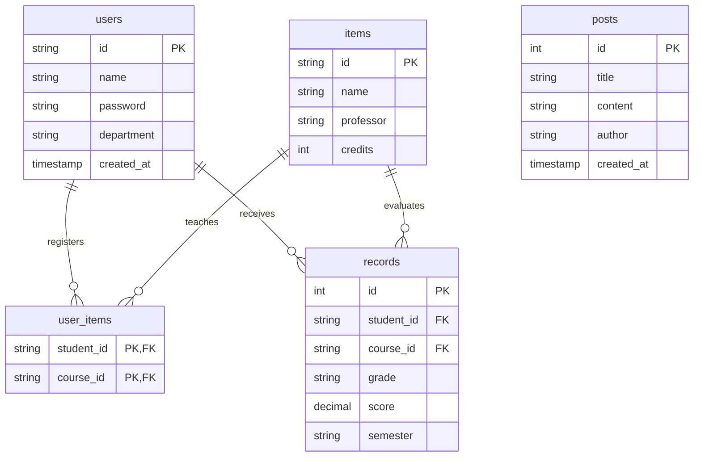

# deploy-sandbox-app Entity Relationship Diagram (ERD)

```mermaid
erDiagram
    users ||--o{ user_items : registers
    items ||--o{ user_items : teaches
    users ||--o{ records : receives
    items ||--o{ records : evaluates
    
    users {
        string id PK
        string name
        string password
        string department
        timestamp created_at
    }

    posts {
        int id PK
        string title
        string content
        string author
        timestamp created_at
    }

    items {
        string id PK
        string name
        string professor
        int credits
    }

    user_items {
        string student_id PK, FK
        string course_id PK, FK
    }

    records {
        int id PK
        string student_id FK
        string course_id FK
        string grade
        decimal score
        string semester
    }
```
